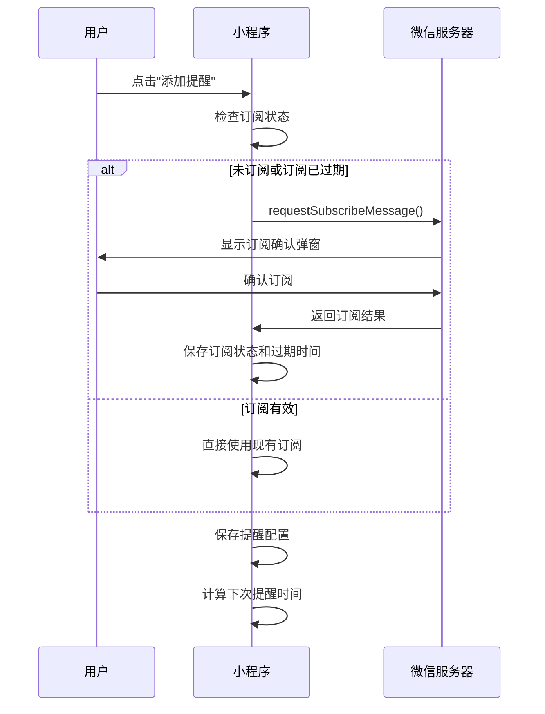
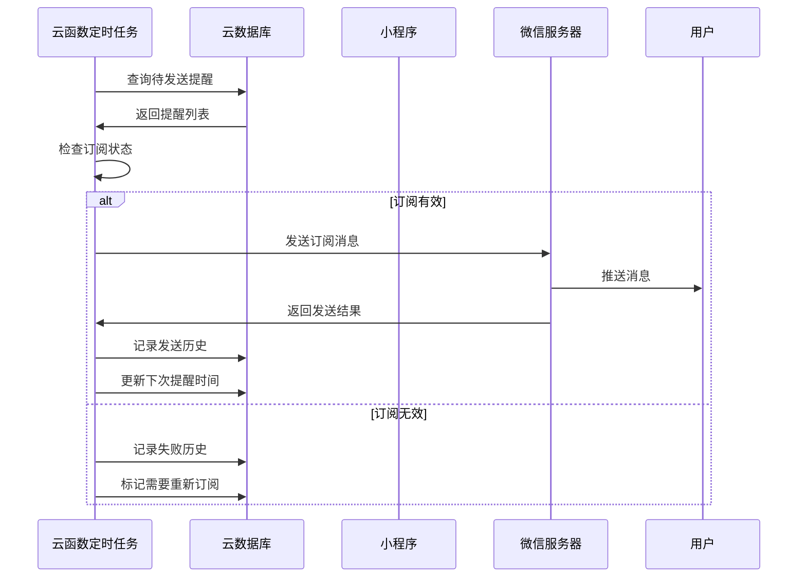

# 植物种植助手提醒功能开发方案

## � 开发项拆分与进度管理

### 📝 0.0 开发流程说明

1. **开始新对话时**：
   - 查看本文档的"待开发的开发项"部分
   - 选择一个状态为"⏳ 待开发"且依赖项已完成的开发项
   - 在新对话中明确说明要开发的开发项编号和名称

2. **开发过程中**：
   - 严格按照开发项的包含内容进行开发
   - 确保交付物完整
   - 遵循本文档中的技术规范和样式规范

3. **开发完成后**：
   - 更新本文档的进度状态
   - 将开发项从"⏳ 待开发"移动到"✅ 已完成的开发项"
   - 更新开发项总览表中的状态
   - 记录完成时间和关键成果
   - 询问用户是否继续

4. **遇到问题时**：
   - 提醒用户遇到问题，提出解决方案，询问用户是否按解决方案处理
   - 在开发项中记录问题和解决方案
   - 更新依赖关系（如有必要）
   - 调整后续开发项的优先级

### ⚠️ 0.1 重要提示
**由于token数限制，本方案已拆分为多个独立的开发项。每次对话只开发一个开发项，开发完成后请更新本文档的进度状态。**

### 📊 0.3 开发项总览

| 开发项编号 | 开发项名称 | 预计工作量 | 状态 | 依赖项 |
|-----------|-----------|-----------|------|--------|
| DEV-001 | 数据结构扩展与存储工具 | 2-3天 | ⏳ 待开发 | 无 |
| DEV-002 | 订阅消息工具函数开发 | 1-2天 | ⏳ 待开发 | DEV-001 |
| DEV-003 | 提醒列表页面样式优化 | 1天 | ⏳ 待开发 | DEV-001 |
| DEV-004 | 提醒添加/编辑页面开发 | 2-3天 | ⏳ 待开发 | DEV-001, DEV-002 |
| DEV-005 | 提醒历史页面开发 | 2-3天 | ⏳ 待开发 | DEV-001, DEV-002 |
| DEV-006 | 云函数开发与部署 | 2-3天 | ⏳ 待开发 | DEV-001, DEV-002, DEV-004 |
| DEV-007 | 集成测试与优化 | 1-2天 | ⏳ 待开发 | DEV-003, DEV-004, DEV-005, DEV-006 |

### ✅ 0.4 已完成的开发项

*暂无已完成的开发项*

### ⏳ 0.5 待开发的开发项

#### DEV-001: 数据结构扩展与存储工具
**目标**：扩展数据模型，完善存储工具函数
**工作量**：2-3天
**依赖**：无
**包含内容**：
- 扩展提醒数据模型（第2.1节）
- 新增提醒历史数据模型（第2.2节）
- 扩展本地存储键定义（第2.3节）
- 扩展存储工具函数（第6.2节）
**交付物**：
- 更新后的数据结构文档
- 完善的storage.js工具函数
- 单元测试用例

#### DEV-002: 订阅消息工具函数开发
**目标**：实现订阅消息申请和管理功能
**工作量**：1-2天
**依赖**：DEV-001
**包含内容**：
- 订阅消息工具函数（第6.1节）
- 订阅状态管理
- 订阅过期时间计算
**交付物**：
- subscription.js工具函数
- 订阅状态管理逻辑
- 单元测试用例

#### DEV-003: 提醒列表页面样式优化
**目标**：优化提醒列表页面，应用卡片样式
**工作量**：1天
**依赖**：DEV-001
**包含内容**：
- 应用卡片样式规范（第3.0.2节）
- 更新提醒列表页面样式
- 添加订阅状态显示
- 添加下次提醒时间倒计时
**交付物**：
- 更新后的reminders.wxml
- 更新后的reminders.wxss
- 更新后的reminders.js

#### DEV-004: 提醒添加/编辑页面开发
**目标**：创建提醒添加和编辑功能页面
**工作量**：2-3天
**依赖**：DEV-001, DEV-002
**包含内容**：
- 页面结构设计（第3.1节）
- 表单功能实现
- 订阅消息申请集成
- 页面样式实现（第3.0.2节）
**交付物**：
- reminder-add页面完整文件
- 表单验证逻辑
- 订阅消息申请功能

#### DEV-005: 提醒历史页面开发
**目标**：创建提醒历史记录查看页面
**工作量**：2-3天
**依赖**：DEV-001, DEV-002
**包含内容**：
- 页面结构设计（第3.2节）
- 历史记录展示
- 筛选功能实现
- 统计信息显示
- 页面样式实现（第3.0.2节）
**交付物**：
- reminder-history页面完整文件
- 筛选功能
- 统计功能

#### DEV-006: 云函数开发与部署
**目标**：开发云函数实现定时提醒发送
**工作量**：2-3天
**依赖**：DEV-001, DEV-002, DEV-004
**包含内容**：
- 发送提醒云函数（第5.2节）
- 检查提醒云函数（第5.3节）
- 定时触发器配置（第5.4节）
- 云函数部署
**交付物**：
- send-reminder云函数
- check-reminders云函数
- 定时触发器配置
- 部署文档

#### DEV-007: 集成测试与优化
**目标**：完成功能测试和用户体验优化
**工作量**：1-2天
**依赖**：DEV-003, DEV-004, DEV-005, DEV-006
**包含内容**：
- 功能完整性测试
- 用户体验优化
- 性能测试
- Bug修复
**交付物**：
- 测试报告
- 优化建议
- 最终版本

### 🎯 0.6 当前开发建议

**推荐开发顺序**：DEV-001 → DEV-002 → DEV-003 → DEV-004 → DEV-005 → DEV-006 → DEV-007

**理由**：
- DEV-001是基础，无依赖，应优先完成
- DEV-002依赖DEV-001，提供订阅消息功能
- DEV-003可以与DEV-002并行开发，优化现有页面
- DEV-004和DEV-005依赖前两项，可以并行开发
- DEV-006需要DEV-004完成后才能测试
- DEV-007是最后的集成测试

---

## �📋 项目概述

### 1.1 背景
当前小程序提醒功能只有一个基础页面，缺少添加提醒、编辑提醒、订阅消息集成、提醒历史记录等核心功能。本方案旨在完善提醒功能，提供完整的智能提醒服务。

### 1.2 目标
- 实现完整的提醒添加/编辑功能
- 集成微信订阅消息推送
- 提供提醒历史记录查看
- 支持自定义提醒类型和频率
- 实现云函数定时触发提醒

### 1.3 技术栈
- **前端**：微信小程序原生开发
- **后端**：微信云开发（云函数）
- **存储**：本地存储 + 云数据库
- **消息推送**：微信订阅消息

---

## 📐 数据结构设计

### 2.1 扩展提醒数据模型

```javascript
{
  _id: "提醒ID",
  plantId: "植物ID",
  type: "watering/fertilizing/custom", // 提醒类型
  customType: "自定义类型名称", // 自定义类型（当type为custom时使用）
  time: "08:00", // 提醒时间（HH:mm格式）
  frequency: 7, // 频率（天数）
  frequencyType: "daily/weekly/monthly/custom", // 频率类型
  nextRemindTime: "2026-01-30T08:00:00.000Z", // 下次提醒时间
  isEnabled: true, // 是否启用
  templateId: "U3WXNNIv14paU3pZJggJ2ftVZglojkvKr9WFecqQOxo", // 订阅消息模板ID
  subscribeStatus: "granted/rejected/need-request/expired", // 订阅状态
  lastSubscribeTime: "2026-01-29T08:00:00.000Z", // 最后订阅时间
  subscribeExpireTime: "2026-02-28T08:00:00.000Z", // 订阅过期时间
  createTime: "创建时间",
  updateTime: "更新时间"
}
```

### 2.2 新增提醒历史数据模型

```javascript
{
  _id: "历史记录ID",
  reminderId: "提醒ID",
  plantId: "植物ID",
  plantName: "植物名称",
  type: "watering/fertilizing/custom",
  customType: "自定义类型名称",
  remindTime: "计划提醒时间",
  sendStatus: "success/failed/pending", // 发送状态
  sendTime: "实际发送时间",
  errorMessage: "错误信息（如果失败）",
  createTime: "创建时间"
}
```

### 2.3 本地存储键定义

```javascript
const STORAGE_KEYS = {
  USER_INFO: 'user_info',
  PLANTS: 'plants',
  RECORDS: 'records',
  REMINDERS: 'reminders',
  REMINDER_HISTORY: 'reminder_history', // 新增
  SYNC_STATE: 'sync_state',
  OFFLINE_QUEUE: 'offline_queue'
}
```

---

## 🎨 页面设计

### 3.0 前端样式设计规范

#### 3.0.1 卡片样式基础规范

所有提醒功能相关页面统一采用卡片式布局设计，参考数据统计页面的模块卡片样式，确保视觉一致性和用户体验的统一性。

**基础卡片样式规范**：

```css
/* 卡片容器 */
.card {
  background-color: #ffffff;
  border-radius: 12rpx;
  padding: 30rpx;
  margin-bottom: 20rpx;
  box-shadow: 0 2rpx 12rpx rgba(0, 0, 0, 0.08);
}

/* 卡片标题 */
.card-title {
  font-size: 32rpx;
  font-weight: 600;
  color: #333;
  margin-bottom: 24rpx;
}

/* 卡片内容区域 */
.card-content {
  display: flex;
  flex-direction: column;
  gap: 20rpx;
}

/* 卡片内子项卡片 */
.sub-card {
  background: #f9f9f9;
  border-radius: 12rpx;
  padding: 16rpx;
  box-shadow: 0 2rpx 12rpx rgba(0, 0, 0, 0.08);
}

/* 卡片头部 */
.card-header {
  display: flex;
  align-items: center;
  margin-bottom: 12rpx;
}

/* 图标容器 */
.icon-wrapper {
  width: 56rpx;
  height: 56rpx;
  border-radius: 50%;
  display: flex;
  align-items: center;
  justify-content: center;
  font-size: 28rpx;
  margin-right: 12rpx;
}

/* 信息区域 */
.info-area {
  flex: 1;
  display: flex;
  align-items: center;
}

/* 统计区域 */
.stats-area {
  display: flex;
  align-items: center;
}

/* 名称文本 */
.name-text {
  font-size: 28rpx;
  color: #333;
  font-weight: 500;
}

/* 数量文本 */
.count-text {
  font-size: 32rpx;
  font-weight: 600;
}

/* 进度条容器 */
.progress-container {
  display: flex;
  align-items: center;
  gap: 8rpx;
}

/* 进度条 */
.progress-bar {
  flex: 1;
  height: 12rpx;
  background: #e0e0e0;
  border-radius: 6rpx;
  overflow: hidden;
}

/* 进度填充 */
.progress-fill {
  height: 100%;
  border-radius: 6rpx;
  transition: width 0.3s ease-in-out;
}

/* 进度文本 */
.progress-text {
  width: 80rpx;
  font-size: 24rpx;
  color: #999;
  text-align: right;
}
```

**颜色主题规范**：

```css
/* 主色调 - 绿色系 */
--primary-color: #4CAF50;
--primary-light: #8BC34A;
--primary-dark: #388E3C;

/* 状态颜色 */
--success-color: #4CAF50;
--warning-color: #FF9800;
--error-color: #F44336;
--info-color: #2196F3;

/* 中性色 */
--text-primary: #333333;
--text-secondary: #666666;
--text-tertiary: #999999;
--bg-primary: #ffffff;
--bg-secondary: #f5f5f5;
--bg-tertiary: #f9f9f9;
--border-color: #e0e0e0;

/* 阴影 */
--shadow-sm: 0 2rpx 8rpx rgba(0, 0, 0, 0.06);
--shadow-md: 0 2rpx 12rpx rgba(0, 0, 0, 0.08);
--shadow-lg: 0 4rpx 16rpx rgba(0, 0, 0, 0.12);
```

**交互效果规范**：

```css
/* 点击效果 */
.clickable {
  transition: background-color 0.2s ease;
}

.clickable:active {
  background-color: rgba(76, 175, 80, 0.1);
}

/* 按钮样式 */
.btn {
  padding: 16rpx 32rpx;
  border-radius: 8rpx;
  font-size: 28rpx;
  font-weight: 500;
  transition: all 0.2s ease;
}

.btn-primary {
  background-color: #4CAF50;
  color: #ffffff;
}

.btn-primary:active {
  background-color: #388E3C;
}

.btn-secondary {
  background-color: #f5f5f5;
  color: #333;
}

.btn-secondary:active {
  background-color: #e0e0e0;
}

/* 输入框样式 */
.input {
  background-color: #f9f9f9;
  border: 1rpx solid #e0e0e0;
  border-radius: 8rpx;
  padding: 20rpx 24rpx;
  font-size: 28rpx;
  color: #333;
}

.input:focus {
  border-color: #4CAF50;
  background-color: #ffffff;
}
```

#### 3.0.2 提醒功能页面样式应用

**提醒列表页面（pages/reminders）**：

```css
/* 统计卡片 */
.stats-card {
  background-color: #ffffff;
  border-radius: 12rpx;
  padding: 30rpx;
  margin-bottom: 20rpx;
  box-shadow: 0 2rpx 12rpx rgba(0, 0, 0, 0.08);
  display: flex;
  justify-content: space-around;
}

.stat-item {
  text-align: center;
  padding: 18rpx;
  border-radius: 16rpx;
  transition: background-color 0.3s ease;
}

.stat-item:active {
  background-color: rgba(76, 175, 80, 0.1);
}

.stat-value {
  font-size: 64rpx;
  font-weight: 600;
  color: #4CAF50;
  margin-bottom: 8rpx;
}

.stat-label {
  font-size: 28rpx;
  color: #666;
}

/* 提醒卡片 */
.reminder-card {
  background: #ffffff;
  border-radius: 12rpx;
  padding: 24rpx;
  margin-bottom: 20rpx;
  box-shadow: 0 2rpx 12rpx rgba(0, 0, 0, 0.08);
}

.reminder-card-header {
  display: flex;
  align-items: center;
  margin-bottom: 12rpx;
}

.reminder-icon {
  width: 56rpx;
  height: 56rpx;
  border-radius: 50%;
  display: flex;
  align-items: center;
  justify-content: center;
  font-size: 28rpx;
  margin-right: 12rpx;
  background-color: rgba(76, 175, 80, 0.2);
  color: #4CAF50;
}

.reminder-info {
  flex: 1;
  display: flex;
  align-items: center;
}

.reminder-name {
  font-size: 28rpx;
  color: #333;
  font-weight: 500;
}

.reminder-stats {
  display: flex;
  align-items: center;
}

.reminder-count {
  font-size: 32rpx;
  font-weight: 600;
  color: #4CAF50;
}

/* 订阅状态标签 */
.subscribe-status {
  display: inline-flex;
  align-items: center;
  padding: 6rpx 12rpx;
  border-radius: 16rpx;
  font-size: 22rpx;
  font-weight: 500;
}

.subscribe-status.granted {
  background-color: rgba(76, 175, 80, 0.1);
  color: #4CAF50;
}

.subscribe-status.rejected {
  background-color: rgba(244, 67, 54, 0.1);
  color: #F44336;
}

.subscribe-status.expired {
  background-color: rgba(255, 152, 0, 0.1);
  color: #FF9800;
}

.subscribe-status.need-request {
  background-color: rgba(158, 158, 158, 0.1);
  color: #999;
}
```

**提醒添加/编辑页面（pages/reminder-add）**：

```css
/* 表单卡片 */
.form-card {
  background-color: #ffffff;
  border-radius: 12rpx;
  padding: 30rpx;
  margin-bottom: 20rpx;
  box-shadow: 0 2rpx 12rpx rgba(0, 0, 0, 0.08);
}

.form-title {
  font-size: 32rpx;
  font-weight: 600;
  color: #333;
  margin-bottom: 24rpx;
}

/* 表单项 */
.form-item {
  margin-bottom: 24rpx;
}

.form-label {
  font-size: 28rpx;
  color: #333;
  font-weight: 500;
  margin-bottom: 12rpx;
  display: block;
}

/* 选择器卡片 */
.selector-card {
  background: #f9f9f9;
  border-radius: 12rpx;
  padding: 16rpx;
  box-shadow: 0 2rpx 12rpx rgba(0, 0, 0, 0.08);
  display: flex;
  align-items: center;
  justify-content: space-between;
}

.selector-icon {
  width: 56rpx;
  height: 56rpx;
  border-radius: 50%;
  display: flex;
  align-items: center;
  justify-content: center;
  font-size: 28rpx;
  margin-right: 12rpx;
  background-color: rgba(76, 175, 80, 0.2);
  color: #4CAF50;
}

.selector-info {
  flex: 1;
  display: flex;
  align-items: center;
}

.selector-name {
  font-size: 28rpx;
  color: #333;
  font-weight: 500;
}

.selector-value {
  font-size: 24rpx;
  color: #999;
}

/* 类型选择卡片组 */
.type-selector-group {
  display: flex;
  flex-direction: column;
  gap: 12rpx;
}

.type-selector-card {
  background: #f9f9f9;
  border-radius: 12rpx;
  padding: 16rpx;
  box-shadow: 0 2rpx 12rpx rgba(0, 0, 0, 0.08);
  display: flex;
  align-items: center;
  transition: all 0.2s ease;
}

.type-selector-card.selected {
  background-color: rgba(76, 175, 80, 0.1);
  border: 2rpx solid #4CAF50;
}

.type-selector-card:active {
  background-color: rgba(76, 175, 80, 0.15);
}

/* 订阅状态卡片 */
.subscribe-card {
  background: #f9f9f9;
  border-radius: 12rpx;
  padding: 16rpx;
  box-shadow: 0 2rpx 12rpx rgba(0, 0, 0, 0.08);
  display: flex;
  align-items: center;
  justify-content: space-between;
}

.subscribe-icon {
  width: 56rpx;
  height: 56rpx;
  border-radius: 50%;
  display: flex;
  align-items: center;
  justify-content: center;
  font-size: 28rpx;
  margin-right: 12rpx;
}

.subscribe-icon.granted {
  background-color: rgba(76, 175, 80, 0.2);
  color: #4CAF50;
}

.subscribe-icon.rejected {
  background-color: rgba(244, 67, 54, 0.2);
  color: #F44336;
}

.subscribe-icon.expired {
  background-color: rgba(255, 152, 0, 0.2);
  color: #FF9800;
}

.subscribe-icon.need-request {
  background-color: rgba(158, 158, 158, 0.2);
  color: #999;
}

.subscribe-info {
  flex: 1;
  display: flex;
  align-items: center;
}

.subscribe-status-text {
  font-size: 28rpx;
  color: #333;
  font-weight: 500;
}

.subscribe-expire-text {
  font-size: 24rpx;
  color: #999;
}

/* 按钮组 */
.button-group {
  display: flex;
  gap: 20rpx;
  margin-top: 30rpx;
}

.button-group .btn {
  flex: 1;
  text-align: center;
}
```

**提醒历史页面（pages/reminder-history）**：

```css
/* 统计卡片 */
.history-stats-card {
  background-color: #ffffff;
  border-radius: 12rpx;
  padding: 30rpx;
  margin-bottom: 20rpx;
  box-shadow: 0 2rpx 12rpx rgba(0, 0, 0, 0.08);
}

.stats-grid {
  display: flex;
  justify-content: space-around;
}

.stat-item {
  text-align: center;
  padding: 18rpx;
  border-radius: 16rpx;
  transition: background-color 0.3s ease;
}

.stat-item:active {
  background-color: rgba(76, 175, 80, 0.1);
}

.stat-value {
  font-size: 64rpx;
  font-weight: 600;
  margin-bottom: 8rpx;
}

.stat-value.success {
  color: #4CAF50;
}

.stat-value.failed {
  color: #F44336;
}

.stat-value.pending {
  color: #FF9800;
}

.stat-label {
  font-size: 28rpx;
  color: #666;
}

/* 筛选卡片 */
.filter-card {
  background-color: #ffffff;
  border-radius: 12rpx;
  padding: 30rpx;
  margin-bottom: 20rpx;
  box-shadow: 0 2rpx 12rpx rgba(0, 0, 0, 0.08);
}

.filter-title {
  font-size: 32rpx;
  font-weight: 600;
  color: #333;
  margin-bottom: 24rpx;
}

.filter-group {
  display: flex;
  flex-wrap: wrap;
  gap: 12rpx;
}

.filter-chip {
  padding: 12rpx 24rpx;
  border-radius: 20rpx;
  font-size: 26rpx;
  background-color: #f5f5f5;
  color: #666;
  transition: all 0.2s ease;
}

.filter-chip.active {
  background-color: #4CAF50;
  color: #ffffff;
}

.filter-chip:active {
  transform: scale(0.95);
}

/* 历史记录卡片 */
.history-card {
  background: #f9f9f9;
  border-radius: 12rpx;
  padding: 16rpx;
  box-shadow: 0 2rpx 12rpx rgba(0, 0, 0, 0.08);
  margin-bottom: 20rpx;
}

.history-card-header {
  display: flex;
  align-items: center;
  margin-bottom: 12rpx;
}

.history-icon {
  width: 56rpx;
  height: 56rpx;
  border-radius: 50%;
  display: flex;
  align-items: center;
  justify-content: center;
  font-size: 28rpx;
  margin-right: 12rpx;
}

.history-icon.success {
  background-color: rgba(76, 175, 80, 0.2);
  color: #4CAF50;
}

.history-icon.failed {
  background-color: rgba(244, 67, 54, 0.2);
  color: #F44336;
}

.history-icon.pending {
  background-color: rgba(255, 152, 0, 0.2);
  color: #FF9800;
}

.history-info {
  flex: 1;
  display: flex;
  align-items: center;
}

.history-plant-name {
  font-size: 28rpx;
  color: #333;
  font-weight: 500;
}

.history-type {
  font-size: 24rpx;
  color: #999;
}

.history-status {
  display: flex;
  align-items: center;
}

.history-status-text {
  font-size: 24rpx;
  font-weight: 500;
}

.history-status-text.success {
  color: #4CAF50;
}

.history-status-text.failed {
  color: #F44336;
}

.history-status-text.pending {
  color: #FF9800;
}

.history-details {
  padding: 12rpx 0;
  border-top: 1rpx solid #e0e0e0;
}

.history-time {
  font-size: 24rpx;
  color: #666;
  margin-bottom: 8rpx;
}

.history-error {
  font-size: 24rpx;
  color: #F44336;
}

/* 操作按钮 */
.action-buttons {
  display: flex;
  justify-content: flex-end;
  gap: 12rpx;
  margin-top: 12rpx;
}

.action-btn {
  padding: 8rpx 20rpx;
  border-radius: 20rpx;
  font-size: 24rpx;
  background-color: #f5f5f5;
  color: #666;
  transition: all 0.2s ease;
}

.action-btn:active {
  background-color: #e0e0e0;
}

.action-btn.delete {
  background-color: #ffebee;
  color: #F44336;
}

.action-btn.delete:active {
  background-color: #ffcdd2;
}
```

#### 3.0.3 响应式设计规范

```css
/* 小屏幕适配 */
@media (max-width: 375px) {
  .card {
    padding: 24rpx;
  }
  
  .card-title {
    font-size: 28rpx;
  }
  
  .stat-value {
    font-size: 56rpx;
  }
}

/* 大屏幕适配 */
@media (min-width: 768px) {
  .card {
    padding: 36rpx;
  }
  
  .card-title {
    font-size: 36rpx;
  }
  
  .stat-value {
    font-size: 72rpx;
  }
}
```

#### 3.0.4 动画效果规范

```css
/* 页面切换动画 */
.page-enter {
  animation: pageEnter 0.3s ease-out;
}

.page-leave {
  animation: pageLeave 0.3s ease-in;
}

@keyframes pageEnter {
  from {
    opacity: 0;
    transform: translateY(20rpx);
  }
  to {
    opacity: 1;
    transform: translateY(0);
  }
}

@keyframes pageLeave {
  from {
    opacity: 1;
    transform: translateY(0);
  }
  to {
    opacity: 0;
    transform: translateY(-20rpx);
  }
}

/* 卡片进入动画 */
.card-enter {
  animation: cardEnter 0.4s ease-out;
}

@keyframes cardEnter {
  from {
    opacity: 0;
    transform: scale(0.95);
  }
  to {
    opacity: 1;
    transform: scale(1);
  }
}

/* 列表项进入动画 */
.list-item-enter {
  animation: listItemEnter 0.3s ease-out;
}

@keyframes listItemEnter {
  from {
    opacity: 0;
    transform: translateX(-20rpx);
  }
  to {
    opacity: 1;
    transform: translateX(0);
  }
}
```

#### 3.0.5 无障碍设计规范

```css
/* 焦点状态 */
.focusable:focus {
  outline: 2rpx solid #4CAF50;
  outline-offset: 2rpx;
}

/* 高对比度模式 */
@media (prefers-contrast: high) {
  .card {
    border: 2rpx solid #333;
  }
  
  .text-primary {
    color: #000;
  }
}

/* 减少动画 */
@media (prefers-reduced-motion: reduce) {
  * {
    animation-duration: 0.01ms !important;
    animation-iteration-count: 1 !important;
    transition-duration: 0.01ms !important;
  }
}
```

#### 3.0.6 样式设计总结

**设计原则**：

1. **一致性原则**：所有提醒功能页面统一采用卡片式布局，确保视觉风格与数据统计页面保持一致
2. **层次性原则**：通过颜色、字体大小、间距等元素建立清晰的信息层次
3. **可读性原则**：确保文字对比度充足，字体大小适中，便于用户阅读
4. **交互性原则**：提供明确的视觉反馈，包括点击效果、状态变化等
5. **响应性原则**：适配不同屏幕尺寸，确保在各种设备上都有良好的显示效果

**卡片样式应用场景**：

| 页面 | 卡片类型 | 用途 |
|------|----------|------|
| 提醒列表页面 | 统计卡片 | 显示提醒总数和活跃数统计 |
| 提醒列表页面 | 提醒卡片 | 展示单个提醒的详细信息 |
| 提醒添加/编辑页面 | 表单卡片 | 包含表单输入和选择器 |
| 提醒添加/编辑页面 | 选择器卡片 | 植物选择、类型选择等 |
| 提醒添加/编辑页面 | 订阅状态卡片 | 显示订阅消息状态 |
| 提醒历史页面 | 统计卡片 | 显示历史记录统计信息 |
| 提醒历史页面 | 筛选卡片 | 提供筛选功能 |
| 提醒历史页面 | 历史记录卡片 | 展示单条历史记录 |

**样式复用策略**：

1. **基础样式类**：定义通用的卡片、按钮、输入框等基础样式类
2. **主题变量**：使用CSS变量定义颜色、字体、间距等主题参数
3. **组件样式**：为可复用组件（如选择器、筛选器）定义独立样式
4. **状态样式**：为不同状态（成功、失败、待处理）定义对应的样式类

**样式文件组织**：

```
styles/
├── base.wxss           # 基础样式（重置、变量、通用类）
├── card.wxss           # 卡片样式（所有卡片类型的样式）
├── button.wxss         # 按钮样式（各种按钮类型）
├── form.wxss           # 表单样式（输入框、选择器等）
├── status.wxss         # 状态样式（成功、失败、警告等）
└── animation.wxss      # 动画样式（页面切换、卡片进入等）
```

**样式实现要点**：

1. **卡片容器**：统一使用 `background-color: #ffffff; border-radius: 12rpx; padding: 30rpx; margin-bottom: 20rpx; box-shadow: 0 2rpx 12rpx rgba(0, 0, 0, 0.08);`
2. **子卡片**：使用 `background: #f9f9f9; border-radius: 12rpx; padding: 16rpx; box-shadow: 0 2rpx 12rpx rgba(0, 0, 0, 0.08);`
3. **图标容器**：统一使用 `width: 56rpx; height: 56rpx; border-radius: 50%; display: flex; align-items: center; justify-content: center; font-size: 28rpx; margin-right: 12rpx;`
4. **进度条**：使用 `flex: 1; height: 12rpx; background: #e0e0e0; border-radius: 6rpx; overflow: hidden;`
5. **主色调**：统一使用绿色系 `#4CAF50` 作为主色调
6. **状态颜色**：成功 `#4CAF50`、失败 `#F44336`、警告 `#FF9800`、信息 `#2196F3`

**样式测试检查清单**：

- [ ] 所有卡片样式与数据统计页面保持一致
- [ ] 颜色对比度符合无障碍标准
- [ ] 在不同屏幕尺寸下显示正常
- [ ] 点击效果和状态变化清晰可见
- [ ] 动画效果流畅自然
- [ ] 文字大小和间距合理
- [ ] 图标和文字对齐正确
- [ ] 表单元素样式统一
- [ ] 状态标识清晰明确
- [ ] 响应式布局正常工作

### 3.1 提醒添加/编辑页面（pages/reminder-add）

#### 3.1.1 功能特性
- 植物选择器（下拉选择）
- 提醒类型选择（浇水/施肥/自定义）
- 自定义类型输入（当选择自定义时显示）
- 时间选择器（选择具体时间）
- 频率选择器（每天/每周/每月/自定义天数）
- 订阅消息申请按钮
- 订阅状态显示
- 保存/取消操作

#### 3.1.2 页面布局

```
┌─────────────────────────┐
│   选择植物               │
│   [下拉选择器]           │
├─────────────────────────┤
│   提醒类型               │
│   [浇水] [施肥] [自定义]  │
│   [自定义类型输入框]     │
├─────────────────────────┤
│   提醒时间               │
│   [时间选择器]           │
├─────────────────────────┤
│   提醒频率               │
│   [每天] [每周] [每月]   │
│   [自定义天数]           │
├─────────────────────────┤
│   订阅消息               │
│   [申请订阅消息]         │
│   ✓ 已订阅 (有效期30天)  │
├─────────────────────────┤
│   [取消]      [保存]     │
└─────────────────────────┘
```

#### 3.1.3 页面文件结构
```
pages/reminder-add/
├── reminder-add.js       # 页面逻辑
├── reminder-add.json     # 页面配置
├── reminder-add.wxml     # 页面结构
└── reminder-add.wxss     # 页面样式
```

### 3.2 提醒历史页面（pages/reminder-history）

#### 3.2.1 功能特性
- 按时间倒序展示提醒历史
- 显示提醒类型、植物名称、发送状态
- 支持按状态筛选（全部/成功/失败/待发送）
- 支持按时间范围筛选
- 显示统计信息（成功次数、失败次数、待发送次数）
- 支持删除历史记录
- 支持清空历史记录

#### 3.2.2 页面布局

```
┌─────────────────────────┐
│   提醒历史               │
│   成功: 10  失败: 2      │
│   待发送: 3              │
├─────────────────────────┤
│   [全部] [成功] [失败]   │
│   [待发送]               │
├─────────────────────────┤
│   📅 2026-01-29 08:00   │
│   浇水 - 绿萝            │
│   ✓ 发送成功             │
├─────────────────────────┤
│   📅 2026-01-28 08:00   │
│   施肥 - 绿萝            │
│   ✗ 发送失败             │
│   错误: 模板ID无效       │
├─────────────────────────┤
│   📅 2026-01-27 08:00   │
│   换盆 - 多肉植物        │
│   ⏳ 待发送              │
└─────────────────────────┘
```

#### 3.2.3 页面文件结构
```
pages/reminder-history/
├── reminder-history.js    # 页面逻辑
├── reminder-history.json  # 页面配置
├── reminder-history.wxml  # 页面结构
└── reminder-history.wxss  # 页面样式
```

### 3.3 提醒列表页面更新（pages/reminders）

#### 3.3.1 新增功能
- 集成提醒添加页面入口
- 集成提醒编辑页面入口
- 集成提醒历史页面入口
- 显示订阅状态
- 显示下次提醒时间倒计时
- 支持批量操作（批量开启/关闭提醒）

#### 3.3.2 页面布局更新

```
┌─────────────────────────┐
│   全部: 5  活跃: 3       │
├─────────────────────────┤
│   [提醒历史] [批量操作]  │
├─────────────────────────┤
│   💧 浇水 - 绿萝         │
│   ⏰ 2小时后             │
│   📅 每天 08:00          │
│   ✓ 已订阅               │
│   [编辑] [删除]          │
├─────────────────────────┤
│   🌱 施肥 - 绿萝         │
│   ⏰ 5天后               │
│   📅 每周 08:00          │
│   ✓ 已订阅               │
│   [编辑] [删除]          │
└─────────────────────────┘
```

---

## 🔧 核心功能实现

### 4.1 订阅消息申请流程



### 4.2 订阅消息发送流程



### 4.3 提醒时间计算逻辑

```javascript
/**
 * 计算下次提醒时间
 * @param {string} currentTime - 当前时间
 * @param {string} time - 提醒时间（HH:mm）
 * @param {number} frequency - 频率（天数）
 * @param {string} frequencyType - 频率类型
 * @returns {string} 下次提醒时间（ISO格式）
 */
function calculateNextRemindTime(currentTime, time, frequency, frequencyType) {
  const now = new Date(currentTime)
  const [hours, minutes] = time.split(':').map(Number)
  
  let nextTime = new Date(now)
  nextTime.setHours(hours, minutes, 0, 0)
  
  // 如果今天的提醒时间已过，则从明天开始计算
  if (nextTime <= now) {
    nextTime.setDate(nextTime.getDate() + 1)
  }
  
  // 根据频率类型计算
  switch (frequencyType) {
    case 'daily':
      // 每天提醒，无需额外计算
      break
    case 'weekly':
      nextTime.setDate(nextTime.getDate() + (frequency - 1) * 7)
      break
    case 'monthly':
      nextTime.setMonth(nextTime.getMonth() + frequency)
      break
    case 'custom':
      nextTime.setDate(nextTime.getDate() + frequency)
      break
  }
  
  return nextTime.toISOString()
}
```

### 4.4 订阅消息模板配置

**模板ID**: `U3WXNNIv14paU3pZJggJ2ftVZglojkvKr9WFecqQOxo`

**模板内容示例**:
```
{{thing1.DATA}}
{{time2.DATA}}
{{thing3.DATA}}
```

**参数说明**:
- `thing1`: 植物名称
- `time2`: 提醒时间
- `thing3`: 提醒类型

---

## ☁️ 云函数设计

### 5.1 云函数结构

```
cloudfunctions/
├── send-reminder/          # 发送提醒消息
│   ├── index.js
│   └── package.json
└── check-reminders/        # 检查待发送提醒
    ├── index.js
    └── package.json
```

### 5.2 发送提醒云函数（send-reminder）

```javascript
// cloudfunctions/send-reminder/index.js
const cloud = require('wx-server-sdk')
cloud.init({
  env: cloud.DYNAMIC_CURRENT_ENV
})

const db = cloud.database()

exports.main = async (event, context) => {
  const { reminderId } = event
  
  try {
    // 获取提醒信息
    const reminderRes = await db.collection('reminders').doc(reminderId).get()
    const reminder = reminderRes.data
    
    // 获取植物信息
    const plantRes = await db.collection('plants').doc(reminder.plantId).get()
    const plant = plantRes.data
    
    // 检查订阅状态
    if (reminder.subscribeStatus !== 'granted') {
      return {
        success: false,
        message: '订阅状态无效'
      }
    }
    
    // 发送订阅消息
    const sendResult = await cloud.openapi.subscribeMessage.send({
      touser: reminder.openid,
      templateId: reminder.templateId,
      page: `pages/plant-detail/plant-detail?id=${reminder.plantId}`,
      data: {
        thing1: {
          value: plant.name
        },
        time2: {
          value: reminder.time
        },
        thing3: {
          value: reminder.type === 'custom' ? reminder.customType : 
                 reminder.type === 'watering' ? '浇水' : '施肥'
        }
      }
    })
    
    // 记录发送历史
    await db.collection('reminder_history').add({
      data: {
        reminderId: reminder._id,
        plantId: reminder.plantId,
        plantName: plant.name,
        type: reminder.type,
        customType: reminder.customType,
        remindTime: reminder.nextRemindTime,
        sendStatus: 'success',
        sendTime: new Date().toISOString(),
        createTime: new Date().toISOString()
      }
    })
    
    // 计算下次提醒时间
    const nextRemindTime = calculateNextRemindTime(
      new Date().toISOString(),
      reminder.time,
      reminder.frequency,
      reminder.frequencyType
    )
    
    // 更新提醒的下次提醒时间
    await db.collection('reminders').doc(reminderId).update({
      data: {
        nextRemindTime: nextRemindTime
      }
    })
    
    return {
      success: true,
      message: '提醒发送成功'
    }
    
  } catch (error) {
    // 记录失败历史
    await db.collection('reminder_history').add({
      data: {
        reminderId: reminderId,
        sendStatus: 'failed',
        errorMessage: error.message,
        createTime: new Date().toISOString()
      }
    })
    
    return {
      success: false,
      message: error.message
    }
  }
}
```

### 5.3 检查提醒云函数（check-reminders）

```javascript
// cloudfunctions/check-reminders/index.js
const cloud = require('wx-server-sdk')
cloud.init({
  env: cloud.DYNAMIC_CURRENT_ENV
})

const db = cloud.database()

exports.main = async (event, context) => {
  try {
    const now = new Date()
    
    // 查询所有待发送的提醒
    const remindersRes = await db.collection('reminders')
      .where({
        isEnabled: true,
        nextRemindTime: db.command.lte(now.toISOString())
      })
      .get()
    
    const reminders = remindersRes.data
    
    // 遍历并发送提醒
    const results = await Promise.all(
      reminders.map(async (reminder) => {
        try {
          // 调用发送提醒云函数
          const result = await cloud.callFunction({
            name: 'send-reminder',
            data: {
              reminderId: reminder._id
            }
          })
          
          return {
            reminderId: reminder._id,
            success: result.result.success,
            message: result.result.message
          }
        } catch (error) {
          return {
            reminderId: reminder._id,
            success: false,
            message: error.message
          }
        }
      })
    )
    
    return {
      success: true,
      total: reminders.length,
      results: results
    }
    
  } catch (error) {
    return {
      success: false,
      message: error.message
    }
  }
}
```

### 5.4 定时触发器配置

在 `cloudfunctions/check-reminders/config.json` 中配置定时触发器：

```json
{
  "triggers": [
    {
      "name": "checkRemindersTimer",
      "type": "timer",
      "config": "0 * * * * * *"
    }
  ]
}
```

说明：`0 * * * * * *` 表示每分钟执行一次，可以根据实际需求调整。

---

## 🛠️ 工具函数设计

### 6.1 订阅消息工具函数（utils/subscription.js）

```javascript
// utils/subscription.js
const storage = require('./storage.js')

class SubscriptionService {
  /**
   * 申请订阅消息
   * @param {string} templateId - 模板ID
   * @returns {Promise<Object>} 订阅结果
   */
  async requestSubscribe(templateId) {
    return new Promise((resolve, reject) => {
      wx.requestSubscribeMessage({
        tmplIds: [templateId],
        success: (res) => {
          if (res[templateId] === 'accept') {
            // 用户同意订阅
            const subscribeData = {
              status: 'granted',
              time: new Date().toISOString(),
              expireTime: this.calculateExpireTime()
            }
            this.saveSubscribeData(subscribeData)
            resolve({
              success: true,
              status: 'granted',
              message: '订阅成功'
            })
          } else if (res[templateId] === 'reject') {
            // 用户拒绝订阅
            const subscribeData = {
              status: 'rejected',
              time: new Date().toISOString()
            }
            this.saveSubscribeData(subscribeData)
            resolve({
              success: false,
              status: 'rejected',
              message: '用户拒绝订阅'
            })
          } else {
            // 其他情况
            resolve({
              success: false,
              status: 'unknown',
              message: '订阅状态未知'
            })
          }
        },
        fail: (error) => {
          reject({
            success: false,
            message: error.errMsg || '订阅失败'
          })
        }
      })
    })
  }
  
  /**
   * 计算订阅过期时间（30天后）
   * @returns {string} 过期时间（ISO格式）
   */
  calculateExpireTime() {
    const expireTime = new Date()
    expireTime.setDate(expireTime.getDate() + 30)
    return expireTime.toISOString()
  }
  
  /**
   * 保存订阅数据
   * @param {Object} subscribeData - 订阅数据
   */
  saveSubscribeData(subscribeData) {
    const userInfo = storage.getUserInfo()
    userInfo.subscribeData = subscribeData
    storage.setUserInfo(userInfo)
  }
  
  /**
   * 获取订阅数据
   * @returns {Object} 订阅数据
   */
  getSubscribeData() {
    const userInfo = storage.getUserInfo()
    return userInfo.subscribeData || {
      status: 'need-request',
      time: null,
      expireTime: null
    }
  }
  
  /**
   * 检查订阅是否有效
   * @returns {boolean} 是否有效
   */
  isSubscribeValid() {
    const subscribeData = this.getSubscribeData()
    
    if (subscribeData.status !== 'granted') {
      return false
    }
    
    if (!subscribeData.expireTime) {
      return false
    }
    
    const now = new Date()
    const expireTime = new Date(subscribeData.expireTime)
    
    return now < expireTime
  }
  
  /**
   * 获取订阅状态文本
   * @returns {string} 状态文本
   */
  getSubscribeStatusText() {
    const subscribeData = this.getSubscribeData()
    
    switch (subscribeData.status) {
      case 'granted':
        if (this.isSubscribeValid()) {
          const expireTime = new Date(subscribeData.expireTime)
          const daysLeft = Math.ceil((expireTime - new Date()) / (1000 * 60 * 60 * 24))
          return `已订阅（剩余${daysLeft}天）`
        } else {
          return '订阅已过期'
        }
      case 'rejected':
        return '已拒绝订阅'
      case 'need-request':
        return '未订阅'
      default:
        return '状态未知'
    }
  }
}

// 导出单例
const subscriptionService = new SubscriptionService()
module.exports = subscriptionService
```

### 6.2 扩展存储工具函数（utils/storage.js）

```javascript
// 在 StorageService 类中添加以下方法

/**
 * 获取提醒历史列表
 * @returns {array} 提醒历史列表
 */
getReminderHistory() {
  return this.get(STORAGE_KEYS.REMINDER_HISTORY, [])
}

/**
 * 设置提醒历史列表
 * @param {array} history 提醒历史列表
 * @returns {boolean} 是否成功
 */
setReminderHistory(history) {
  return this.set(STORAGE_KEYS.REMINDER_HISTORY, history)
}

/**
 * 添加提醒历史记录
 * @param {object} historyItem 历史记录项
 * @returns {boolean} 是否成功
 */
addReminderHistory(historyItem) {
  const history = this.getReminderHistory()
  historyItem._id = this.generateId()
  historyItem.createTime = new Date().toISOString()
  history.unshift(historyItem) // 添加到开头
  
  // 限制历史记录数量，最多保留1000条
  if (history.length > 1000) {
    history.length = 1000
  }
  
  return this.setReminderHistory(history)
}

/**
 * 删除提醒历史记录
 * @param {string} historyId 历史记录ID
 * @returns {boolean} 是否成功
 */
deleteReminderHistory(historyId) {
  const history = this.getReminderHistory()
  const filteredHistory = history.filter(h => h._id !== historyId)
  if (filteredHistory.length !== history.length) {
    return this.setReminderHistory(filteredHistory)
  }
  return false
}

/**
 * 清空提醒历史记录
 * @returns {boolean} 是否成功
 */
clearReminderHistory() {
  return this.setReminderHistory([])
}

/**
 * 获取提醒历史统计
 * @returns {object} 统计信息
 */
getReminderHistoryStats() {
  const history = this.getReminderHistory()
  
  const stats = {
    total: history.length,
    success: 0,
    failed: 0,
    pending: 0
  }
  
  history.forEach(item => {
    switch (item.sendStatus) {
      case 'success':
        stats.success++
        break
      case 'failed':
        stats.failed++
        break
      case 'pending':
        stats.pending++
        break
    }
  })
  
  return stats
}

/**
 * 筛选提醒历史记录
 * @param {object} filters 筛选条件
 * @returns {array} 筛选后的历史记录
 */
filterReminderHistory(filters) {
  let history = this.getReminderHistory()
  
  // 按状态筛选
  if (filters.status && filters.status !== 'all') {
    history = history.filter(h => h.sendStatus === filters.status)
  }
  
  // 按时间范围筛选
  if (filters.startTime) {
    history = history.filter(h => new Date(h.createTime) >= new Date(filters.startTime))
  }
  
  if (filters.endTime) {
    history = history.filter(h => new Date(h.createTime) <= new Date(filters.endTime))
  }
  
  // 按植物筛选
  if (filters.plantId) {
    history = history.filter(h => h.plantId === filters.plantId)
  }
  
  // 按提醒类型筛选
  if (filters.type) {
    history = history.filter(h => h.type === filters.type)
  }
  
  return history
}
```

---

## 📊 实施计划

### 7.1 开发阶段划分

#### 第一阶段：基础架构搭建（预计2-3天）
- [ ] 扩展数据结构
- [ ] 创建订阅消息工具函数
- [ ] 扩展存储工具函数
- [ ] 配置云开发环境

#### 第二阶段：页面开发（预计3-4天）
- [ ] 创建提醒添加/编辑页面
- [ ] 创建提醒历史页面
- [ ] 更新提醒列表页面
- [ ] 集成订阅消息申请功能

#### 第三阶段：云函数开发（预计2-3天）
- [ ] 开发发送提醒云函数
- [ ] 开发检查提醒云函数
- [ ] 配置定时触发器
- [ ] 测试云函数功能

#### 第四阶段：集成测试（预计1-2天）
- [ ] 功能完整性测试
- [ ] 用户体验优化
- [ ] 性能测试
- [ ] 发布准备

### 7.2 关键里程碑

| 里程碑 | 完成标准 | 预计时间 |
|--------|----------|----------|
| 数据结构完成 | 所有数据模型和工具函数就绪 | 第3天 |
| 页面开发完成 | 所有页面UI和交互功能完成 | 第7天 |
| 云函数部署完成 | 云函数正常运行，定时触发正常 | 第10天 |
| 集成测试完成 | 所有功能测试通过，无重大bug | 第12天 |

---

## ⚠️ 注意事项

### 8.1 技术限制
- 微信订阅消息有发送频率限制
- 云函数有执行时长限制（最长60秒）
- 本地存储空间有限（10MB）
- 定时触发器最小间隔为1分钟

### 8.2 用户体验考虑
- 首次订阅需要用户手动授权
- 订阅消息有30天有效期
- 提醒时间需要考虑用户时区
- 提供清晰的错误提示和重试机制

### 8.3 数据安全
- 敏感信息需要加密存储
- 用户隐私数据保护
- 防止恶意订阅请求
- 定期清理过期数据

---

## 📈 后续优化方向

### 9.1 功能增强
- 支持多种提醒模板
- 增加智能推荐算法
- 支持语音提醒
- 增加社区分享功能

### 9.2 性能优化
- 实现数据分页加载
- 优化云函数执行效率
- 增加缓存机制
- 减少不必要的网络请求

### 9.3 运营分析
- 增加用户行为分析
- 收集用户反馈
- 优化提醒策略
- 提升用户留存率

---

**文档版本**: v1.0  
**创建时间**: 2026年1月29日  
**最后更新**: 2026年1月29日  
**负责人**: CodeFree