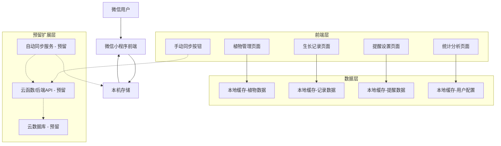
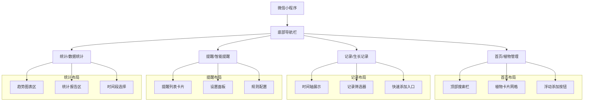

# 植物种植助手微信小程序 - 项目计划书

## 项目概述

### 基本信息
- **项目名称**：植物种植助手
- **目标用户**：园丁、农民、园艺爱好者
- **技术平台**：微信小程序 + 本地存储（云功能预留）
- **核心价值**：简化植物生长记录，提供智能提醒服务
- **数据策略**：本地存储优先，云端同步功能预留

### 项目背景
随着城市农业和家庭园艺的兴起，越来越多的人开始种植植物。然而，缺乏专业的养护知识和系统的记录工具成为主要痛点。本项目旨在通过微信小程序为植物爱好者提供便捷的生长记录和智能提醒服务。前期采用本地存储优先的方案，确保快速开发和用户体验，同时预留云端同步功能接口，便于后续扩展。

## 功能需求分析

### 核心功能模块

#### 1. 植物管理模块
- **功能描述**：管理用户的植物信息
- **具体功能**：
  - 添加/编辑/删除植物信息
  - 植物分类管理（花卉、蔬菜、果树等）
  - 图片上传和展示
  - 基础信息记录（种植日期、品种等）

#### 2. 生长记录模块
- **功能描述**：记录植物的生长过程
- **具体功能**：
  - 浇水记录（时间、水量）
  - 施肥记录（肥料类型、用量）
  - 生长状态记录（高度、健康状况）
  - 照片时间线记录
  - 病虫害记录

#### 3. 智能提醒模块
- **功能描述**：提供定时养护提醒
- **具体功能**：
  - 自定义提醒规则（按天/周/月）
  - 微信订阅消息推送
  - 提醒历史记录
  - 提醒开关控制

#### 4. 数据统计模块
- **功能描述**：提供数据分析和可视化
- **具体功能**：
  - 生长趋势分析图表
  - 养护频率统计
  - 月度养护报告
  - 成功率统计

### 非功能需求
- **性能要求**：页面加载时间 < 2秒
- **可用性**：界面简洁易用，适合各年龄段用户
- **可靠性**：数据同步准确率 > 99%
- **安全性**：用户数据隐私保护

## 系统架构设计

### 整体架构（前期版本）


### 技术架构说明

#### 前端架构（前期版本）
- **框架**：微信小程序原生开发
- **UI组件库**：Vant Weapp
- **状态管理**：小程序自带的setData机制 + 本地状态管理
- **本地存储**：wx.setStorage/wx.getStorage（10MB存储空间）
- **数据持久化**：完全依赖本地存储，无网络依赖
- **扩展预留**：手动同步按钮接口预留

#### 后端架构（预留扩展）
- **平台**：微信云开发（预留接口）
- **运行环境**：Node.js 16+（未来扩展）
- **数据库**：云数据库（MongoDB兼容）- 预留
- **云函数**：业务逻辑处理 - 预留
- **存储**：云存储（图片、文件）- 预留

## 页面设计与用户体验

### 整体布局设计
采用底部标签栏导航设计，包含四个主要功能入口：
- **首页**：植物管理模块
- **记录**：生长记录模块
- **提醒**：智能提醒模块
- **统计**：数据统计模块



**视觉风格**：清新自然，以绿色系为主色调，营造与植物相关的舒适视觉体验。界面简洁直观，适合各年龄段用户使用。

### 1. 首页 - 植物管理模块

**布局结构**：
- **顶部**：搜索栏和同步按钮
- **中部**：植物卡片网格布局
- **交互**：支持下拉刷新和上拉加载更多
- **浮动按钮**：右上角+号按钮快速添加新植物

**功能细节**：
- 每张植物卡片显示缩略图、名称和简要信息
- 点击卡片进入详情页查看完整信息和分类管理
- 支持植物信息的编辑和删除操作
- **手动同步按钮**：顶部右侧同步图标，点击触发数据同步（预留功能）
- **同步状态显示**：同步按钮旁显示上次同步时间

### 2. 生长记录模块

**布局结构**：
- **展示方式**：时间轴设计，按日期分组
- **记录类型**：浇水、施肥、生长状态、照片等
- **交互设计**：每个时间点可展开详细信息

**功能细节**：
- 支持快速添加各类记录
- 顶部设有筛选器，可按记录类型筛选查看
- 图片记录支持预览和放大查看

### 3. 智能提醒模块

**布局结构**：
- **提醒列表区域**：卡片形式展示待办事项
- **设置区域**：自定义提醒规则界面

**功能细节**：
- 提醒卡片包含提醒类型、时间、执行状态
- 支持选择特定植物设置提醒
- 可设置提醒频率（天/周/月）
- 提供提醒开关控制功能

### 4. 数据统计模块

**布局结构**：
- **图表展示区**：多种可视化图表
- **报告摘要区**：月度报告和关键指标

**功能细节**：
- **生长趋势折线图**：展示植物生长变化
- **养护频率柱状图**：统计浇水施肥频率
- **成功率饼图**：分析养护成功率
- **时间段切换**：支持查看不同时间段的统计数据

## 数据库设计（前期版本）
### 存储策略说明
本项目前期采用**本地存储优先**的策略，云端功能作为预留扩展：

#### 本机存储（主存储）
- **用途**：所有用户数据的本地持久化存储
- **特点**：零延迟、完全离线可用、无网络依赖
- **存储空间**：微信小程序提供10MB本地存储空间
- **适用场景**：所有植物管理、生长记录、提醒设置功能

#### 云端存储（预留扩展）
- **用途**：未来实现数据备份和多设备同步
- **特点**：预留接口，暂不实现
- **适用场景**：后续版本的数据同步和备份功能

### 数据同步机制（预留）
**前期版本**：无自动同步功能，完全依赖本地存储

**预留接口**：
1. **手动同步按钮**：在植物管理页面添加同步按钮
2. **同步状态显示**：显示上次同步时间和状态
3. **错误处理**：同步失败时的用户提示

**未来扩展**：
- 自动同步功能
- 多设备数据同步
- 云端备份和恢复

### 核心数据模型

#### 用户表 (users)
```javascript
{
  _id: "用户唯一ID",
  openid: "微信OpenID",
  nickname: "用户昵称",
  avatarUrl: "头像URL",
  createTime: "注册时间",
  lastLoginTime: "最后登录时间"
}
```

#### 植物表 (plants)
```javascript
{
  _id: "植物唯一ID",
  userId: "用户ID",
  name: "植物名称",
  type: "植物类型",
  plantDate: "种植日期",
  imageUrl: "植物图片",
  description: "描述信息",
  status: "生长状态",
  createTime: "创建时间"
}
```

#### 生长记录表 (records)
```javascript
{
  _id: "记录唯一ID",
  plantId: "植物ID",
  type: "记录类型（watering/fertilizing/growth）",
  content: "记录内容",
  value: "数值（如水量、高度）",
  imageUrl: "记录图片",
  recordTime: "记录时间",
  createTime: "创建时间"
}
```

#### 提醒配置表 (reminders)
```javascript
{
  _id: "提醒配置ID",
  userId: "用户ID",
  plantId: "植物ID",
  type: "提醒类型（watering/fertilizing）",
  frequency: "频率（days）",
  nextRemindTime: "下次提醒时间",
  isEnabled: "是否启用",
  templateId: "微信模板ID",
  createTime: "创建时间"
}
```

#### 本机存储数据结构
```javascript
// 本地缓存数据格式
{
  // 用户基础信息（从云端同步）
  userInfo: {
    openid: "微信OpenID",
    nickname: "用户昵称",
    lastSyncTime: "最后同步时间"
  },
  
  // 植物数据（本地操作优先）
  plants: [
    {
      _id: "植物唯一ID",
      name: "植物名称",
      type: "植物类型",
      plantDate: "种植日期",
      imageUrl: "植物图片",
      status: "生长状态",
      localModified: true, // 标记是否本地修改
      syncStatus: "pending" // 同步状态
    }
  ],
  
  // 记录数据
  records: [
    {
      _id: "记录唯一ID",
      plantId: "植物ID",
      type: "记录类型",
      content: "记录内容",
      recordTime: "记录时间",
      localCreated: true // 标记是否本地创建
    }
  ],
  
  // 离线操作队列
  offlineQueue: [
    {
      id: "操作ID",
      type: "create|update|delete",
      table: "plants|records|reminders",
      data: {},
      timestamp: "操作时间戳"
    }
  ],
  
  // 同步状态
  syncState: {
    lastSyncTime: "最后成功同步时间",
    pendingCount: 5, // 待同步操作数量
    isSyncing: false // 是否正在同步
  }
}
```

## 技术栈选择与配置

### 前端技术栈
| 技术组件 | 选择方案 | 理由 |
|---------|---------|------|
| 开发框架 | 微信小程序原生 | 官方支持，生态完善 |
| UI组件库 | Vant Weapp | 组件丰富，风格统一 |
| 本地存储 | wx.storage + 自定义缓存层 | 支持离线数据管理 |
| 数据同步 | 自定义同步服务 | 云+本地数据同步 |
| 图标库 | 微信小程序内置图标 | 轻量，无需额外引入 |
| 图表库 | F2或ECharts小程序版 | 数据可视化需求 |

### 后端技术栈
| 技术组件 | 选择方案 | 理由 |
|---------|---------|------|
| 云平台 | 微信云开发 | 免运维，快速部署 |
| 数据库 | 云数据库 | 自动扩容，高可用 |
| 云函数 | Node.js 16+ | JavaScript全栈开发 |
| 存储服务 | 云存储 | 文件自动CDN分发 |

### 第三方服务集成
- **微信订阅消息**：用于定时提醒推送
- **微信支付**：未来可能的付费功能
- **腾讯位置服务**：地理位置相关功能扩展

## 开发时间线规划（前期版本）

### 第一阶段：基础框架搭建（1.5周）
**第1周**
- [ ] 项目初始化和小程序配置
- [ ] 基础页面结构搭建（底部导航）
- [ ] 本地存储服务实现
- [ ] 页面路由和导航配置
- [ ] 基础样式和主题配置（绿色系）

**第2周前半**
- [ ] 植物管理页面基础布局
- [ ] 本地数据CRUD操作封装
- [ ] 图片上传和本地存储
- [ ] 手动同步按钮UI实现（预留功能）

### 第二阶段：核心功能开发（2.5周）
**第2周后半**
- [ ] 植物管理完整功能实现
- [ ] 植物卡片网格布局优化
- [ ] 搜索和筛选功能
- [ ] 手动同步按钮交互逻辑（预留）

**第3周**
- [ ] 生长记录功能开发
- [ ] 时间轴式记录展示
- [ ] 快速添加记录功能
- [ ] 记录类型筛选器

**第4周前半**
- [ ] 智能提醒功能实现
- [ ] 本地提醒规则设置
- [ ] 提醒列表展示
- [ ] 提醒开关控制

### 第三阶段：高级功能实现（1周）
**第4周后半**
- [ ] 数据统计功能实现
- [ ] 图表可视化展示
- [ ] 月度报告生成
- [ ] 用户体验优化和测试

### 第四阶段：测试部署（0.5周）
**第5周前半**
- [ ] 功能完整性测试
- [ ] 性能优化
- [ ] 用户体验优化
- [ ] 微信小程序审核准备

**第5周后半**
- [ ] 正式发布

## 风险评估与应对策略

### 技术风险（前期版本）
| 风险类型 | 风险描述 | 影响程度 | 应对策略 |
|---------|---------|---------|---------|
| 本机存储容量 | 微信小程序10MB存储限制 | 中 | 数据压缩，定期清理过期记录 |
| 数据丢失风险 | 设备更换或卸载导致数据丢失 | 高 | 明确告知用户数据本地存储特性 |
| 性能问题 | 大量数据时本地操作性能下降 | 低 | 分批加载，虚拟滚动优化 |

### 业务风险
| 风险类型 | 风险描述 | 影响程度 | 应对策略 |
|---------|---------|---------|---------|
| 用户接受度 | 用户对产品功能不感兴趣 | 中 | 种子用户测试，快速迭代 |
| 市场竞争 | 已有类似产品竞争 | 低 | 差异化功能，专注细分市场 |
| 需求变化 | 用户需求随时间变化 | 中 | 灵活架构，支持功能扩展 |

### 运营风险
| 风险类型 | 风险描述 | 影响程度 | 应对策略 |
|---------|---------|---------|---------|
| 微信审核 | 小程序审核不通过 | 高 | 提前了解审核规范，准备充分 |
| 用户留存 | 用户活跃度下降 | 中 | 持续优化体验，增加粘性功能 |

## 成功指标与评估

### 关键绩效指标（KPI）

#### 用户增长指标
- **新增用户数**：首月目标1000人
- **用户留存率**：30日留存 > 40%
- **用户活跃度**：日均使用时长 > 5分钟

#### 功能使用指标
- **核心功能使用率**：植物管理功能使用率 > 80%
- **提醒功能使用率**：设置提醒的用户比例 > 60%
- **记录频率**：平均每用户每周记录次数 > 3次

#### 业务健康指标
- **数据准确性**：数据同步成功率 > 99%
- **离线使用率**：离线操作占比 > 20%
- **同步效率**：数据同步延迟 < 30秒
- **系统稳定性**：服务可用性 > 99.5%
- **用户满意度**：应用商店评分 > 4.5分

### 评估周期
- **短期评估**（1个月）：用户增长和基础功能使用情况
- **中期评估**（3个月）：用户留存和功能深度使用
- **长期评估**（6个月）：商业价值和用户忠诚度

## 预算估算

### 开发成本
| 项目 | 估算 | 备注 |
|-----|------|------|
| 开发人员成本 | 3人 × 9周 × ¥8000/周 | 前端1人，后端1人，测试1人 |
| 云服务费用 | ¥500/月 | 微信云开发基础套餐 |
| 第三方服务 | ¥200/月 | 图表服务、CDN等 |
| 合计 | ¥216,000 + ¥700/月 | 一次性开发+月度运营 |

### 运营成本
| 项目 | 估算 | 备注 |
|-----|------|------|
| 服务器维护 | ¥300/月 | 云开发自动包含 |
| 数据备份 | ¥100/月 | 云数据库备份 |
| 监控服务 | ¥200/月 | 性能监控和告警 |
| 合计 | ¥600/月 | 基础运营成本 |

## 后续发展规划

### 短期规划（3-6个月）
1. **功能完善**：基于用户反馈优化现有功能
2. **用户体验**：持续改进界面和交互设计
3. **性能优化**：提升加载速度和响应性能

### 中期规划（6-12个月）
1. **功能扩展**：增加植物识别、社区分享等功能
2. **平台扩展**：考虑开发App版本
3. **商业化探索**：增值服务或广告模式

### 长期规划（1年以上）
1. **生态建设**：建立植物养护知识库
2. **合作伙伴**：与园艺用品商家合作
3. **国际化**：拓展海外市场

---

**文档版本**：v1.0  
**创建时间**：2026年1月22日  
**最后更新**：2026年1月22日  
**负责人**：项目团队